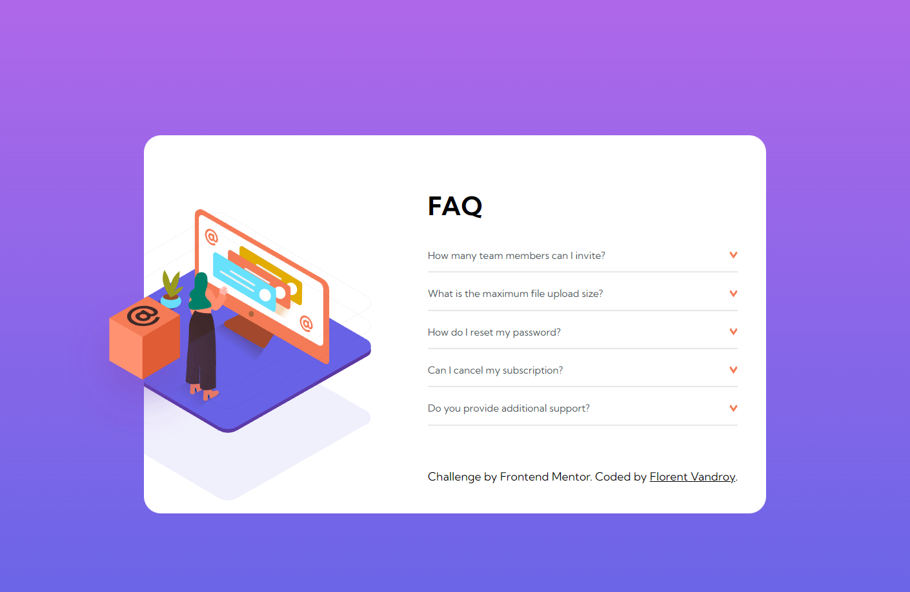

# Frontend Mentor - FAQ accordion card solution

This is a solution to the [FAQ accordion card challenge on Frontend Mentor](https://www.frontendmentor.io/challenges/faq-accordion-card-XlyjD0Oam). Frontend Mentor challenges help you improve your coding skills by building realistic projects. 

## Table of contents

- [The challenge](#the-challenge)
- [Screenshot](#screenshot)
- [Links](#links)
- [Built with](#built-with)

## The challenge

Users should be able to:

- View the optimal layout for the component depending on their device's screen size
- See hover states for all interactive elements on the page
- Hide/Show the answer to a question when the question is clicked

## Screenshot

## Links

- Solution URL: [Change](Change)
- Live Site URL: [https://florent6001.github.io/frontend-mentor/faq-accordion-card/](https://florent6001.github.io/frontend-mentor/faq-accordion-card/)

## Built with

- [TailWindCSS](https://tailwindcss.com/) - CSS Framework
- Vanilla Javascript

## Author

- Website - [Florent Vandroy](https://www.florent-vandroy.fr)
- Frontend Mentor - [@florent6001](https://www.frontendmentor.io/profile/florent6001)