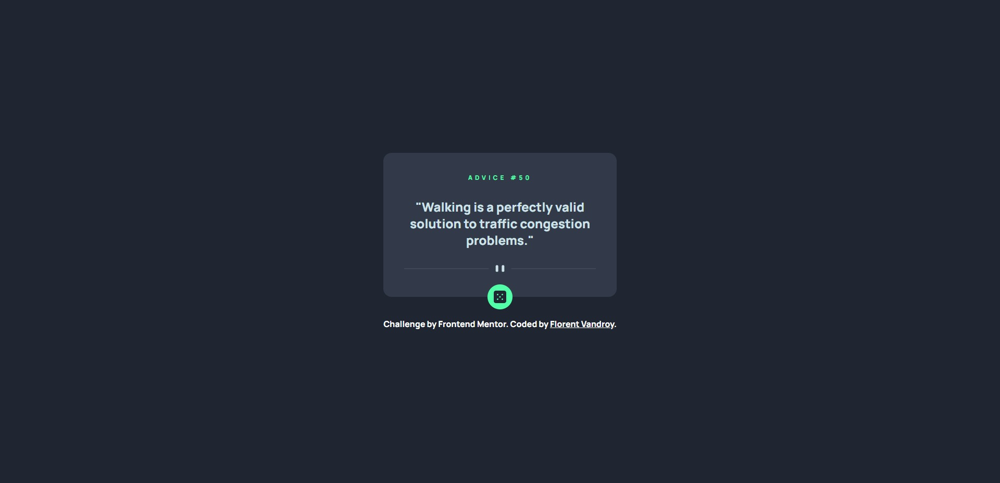

# Frontend Mentor - Advice generator app solution

This is a solution to the [Advice generator app challenge on Frontend Mentor](https://www.frontendmentor.io/challenges/advice-generator-app-QdUG-13db). Frontend Mentor challenges help you improve your coding skills by building realistic projects.

## Table of contents

- [The challenge](#the-challenge)
- [Screenshot](#screenshot)
- [Links](#links)
- [Built with](#built-with)

## The challenge

Users should be able to:

- View the optimal layout for the app depending on their device's screen size
- See hover states for all interactive elements on the page
- Generate a new piece of advice by clicking the dice icon

## Screenshot

## Links

- Solution URL: [https://www.frontendmentor.io/solutions/advice-generator-app-tailwindcss-and-vanillajs-HrMHDDmV3E](https://www.frontendmentor.io/solutions/advice-generator-app-tailwindcss-and-vanillajs-HrMHDDmV3E)
- Live Site URL: [https://florent6001.github.io/frontend-mentor/junior/advice-generator-app](https://florent6001.github.io/frontend-mentor/junior/advice-generator-app)

## Built with

- [TailWindCSS](https://tailwindcss.com/) - CSS Framework
- Vanilla JS

## Author

- Website - [Florent Vandroy](https://www.florent-vandroy.fr)
- Frontend Mentor - [@florent6001](https://www.frontendmentor.io/profile/florent6001)