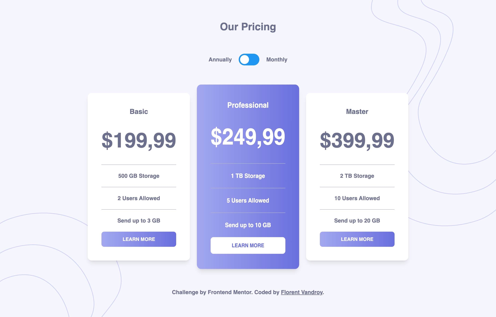

# Frontend Mentor - Pricing component with toggle solution

This is a solution to the [Pricing component with toggle challenge on Frontend Mentor](https://www.frontendmentor.io/challenges/pricing-component-with-toggle-8vPwRMIC). Frontend Mentor challenges help you improve your coding skills by building realistic projects. 

## Table of contents

- [The challenge](#the-challenge)
- [Screenshot](#screenshot)
- [Links](#links)
- [Built with](#built-with)

## The challenge

Users should be able to:

- View the optimal layout for the component depending on their device's screen size
- Control the toggle with both their mouse/trackpad and their keyboard
- **Bonus**: Complete the challenge with just HTML and CSS

## Screenshot

## Links

- Solution URL: 
- Live Site URL: [https://florent6001.github.io/frontend-mentor/junior/pricing-component-with-toggle/](https://florent6001.github.io/frontend-mentor/junior/pricing-component-with-toggle/)

## Built with

- [TailWindCSS](https://tailwindcss.com/) - CSS Framework
- Vanilla JS

## Author

- Website - [Florent Vandroy](https://www.florent-vandroy.fr)
- Frontend Mentor - [@florent6001](https://www.frontendmentor.io/profile/florent6001)
