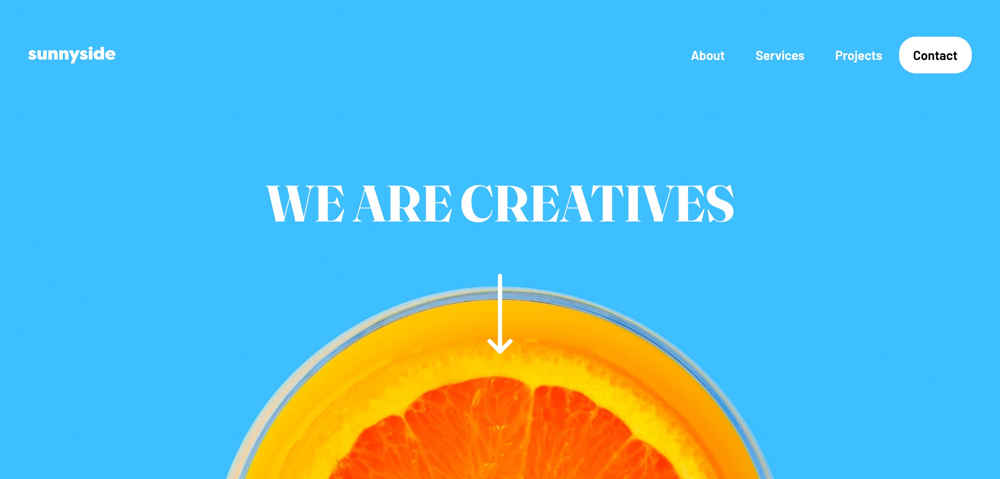

# Frontend Mentor - Sunnyside agency landing page solution

This is a solution to the [Sunnyside agency landing page challenge on Frontend Mentor](https://www.frontendmentor.io/challenges/sunnyside-agency-landing-page-7yVs3B6ef). Frontend Mentor challenges help you improve your coding skills by building realistic projects.

## Table of contents

- [The challenge](#the-challenge)
- [Screenshot](#screenshot)
- [Links](#links)
- [Built with](#built-with)

### The challenge

Users should be able to:

- View the optimal layout for the site depending on their device's screen size
- See hover states for all interactive elements on the page

## Screenshot

## Links

- Solution URL: [https://www.frontendmentor.io/solutions/sunnyside-agency-landing-page-vanillajs-and-tailwindcss-ybNaQVi53k](https://www.frontendmentor.io/solutions/sunnyside-agency-landing-page-vanillajs-and-tailwindcss-ybNaQVi53k)
- Live Site URL: [https://florent6001.github.io/frontend-mentor/junior/sunnyside-agency-landing-page-7yVs3B6ef/](https://florent6001.github.io/frontend-mentor/junior/sunnyside-agency-landing-page-7yVs3B6ef/)

## Built with

- [TailWindCSS](https://tailwindcss.com/) - CSS Framework
- Vanilla JS

## Author

- Website - [Florent Vandroy](https://www.florent-vandroy.fr)
- Frontend Mentor - [@florent6001](https://www.frontendmentor.io/profile/florent6001)
