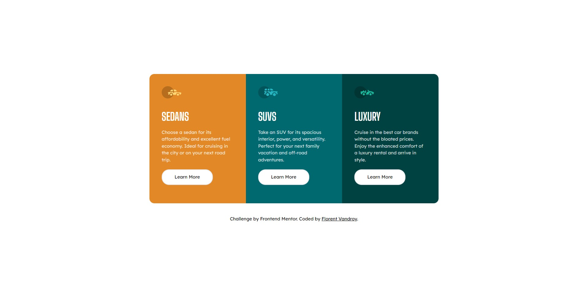

# Frontend Mentor - 3-column preview card component solution

This is a solution to the [3-column preview card component challenge on Frontend Mentor](https://www.frontendmentor.io/challenges/3column-preview-card-component-pH92eAR2-). Frontend Mentor challenges help you improve your coding skills by building realistic projects. 

## Table of contents

- [The challenge](#the-challenge)
- [Screenshot](#screenshot)
- [Links](#links)
- [Built with](#built-with)

## The challenge

Users should be able to:

- View the optimal layout depending on their device's screen size
- See hover states for interactive elements

## Screenshot

## Links

- Solution URL: [https://www.frontendmentor.io/solutions/3column-preview-card-component-tailwindcss-73dCOaqRVv](https://www.frontendmentor.io/solutions/3column-preview-card-component-tailwindcss-73dCOaqRVv)
- Live Site URL: [https://florent6001.github.io/frontend-mentor/3-column-preview-card-component/](https://florent6001.github.io/frontend-mentor/3-column-preview-card-component/)

## Built with

- [TailWindCSS](https://tailwindcss.com/) - CSS Framework

## Author

- Website - [Florent Vandroy](https://www.florent-vandroy.fr)
- Frontend Mentor - [@florent6001](https://www.frontendmentor.io/profile/florent6001)