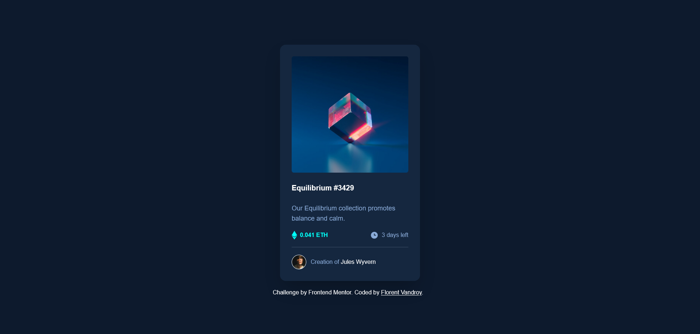

# Frontend Mentor - NFT preview card component solution

This is a solution to the [NFT preview card component challenge on Frontend Mentor](https://www.frontendmentor.io/challenges/nft-preview-card-component-SbdUL_w0U). Frontend Mentor challenges help you improve your coding skills by building realistic projects. 

## Table of contents

- [Screenshot](#screenshot)
- [Links](#links)
- [Built with](#built-with)

## Screenshot

## Links

- Solution URL: [https://www.frontendmentor.io/solutions/nft-preview-card-component-tailwindcss-YJLN7I2JlI](https://www.frontendmentor.io/solutions/nft-preview-card-component-tailwindcss-YJLN7I2JlI)
- Live Site URL: [https://florent6001.github.io/frontend-mentor/newbie/nft-preview-card-component](https://florent6001.github.io/frontend-mentor/newbie/nft-preview-card-component)

## Built with

- [TailWindCSS](https://tailwindcss.com/) - CSS Framework

## Author

- Website - [Florent Vandroy](https://www.florent-vandroy.fr)
- Frontend Mentor - [@florent6001](https://www.frontendmentor.io/profile/florent6001)