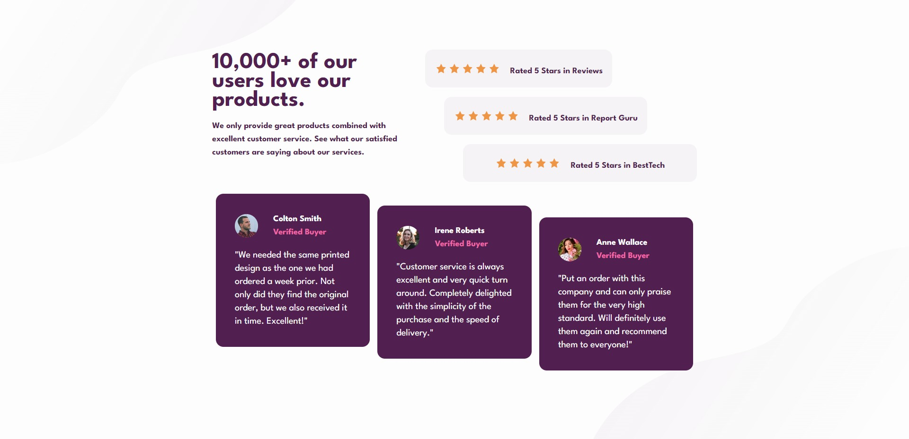

# Frontend Mentor - Social proof section solution

This is a solution to the [Social proof section challenge on Frontend Mentor](https://www.frontendmentor.io/challenges/social-proof-section-6e0qTv_bA). Frontend Mentor challenges help you improve your coding skills by building realistic projects. 

## Table of contents

- [The challenge](#the-challenge)
- [Screenshot](#screenshot)
- [Links](#links)
- [Built with](#built-with)

## The challenge

Users should be able to:

- View the optimal layout for the section depending on their device's screen size

## Screenshot

## Links

- Solution URL: [https://www.frontendmentor.io/solutions/social-proof-section-tailwindcss-zzTnD_FSC5](https://www.frontendmentor.io/solutions/social-proof-section-tailwindcss-zzTnD_FSC5)
- Live Site URL: [https://florent6001.github.io/frontend-mentor/social-proof-section/](https://florent6001.github.io/frontend-mentor/social-proof-section/)

## Built with

- [TailWindCSS](https://tailwindcss.com/) - CSS Framework
- Vanilla Javascript

## Author

- Website - [Florent Vandroy](https://www.florent-vandroy.fr)
- Frontend Mentor - [@florent6001](https://www.frontendmentor.io/profile/florent6001)